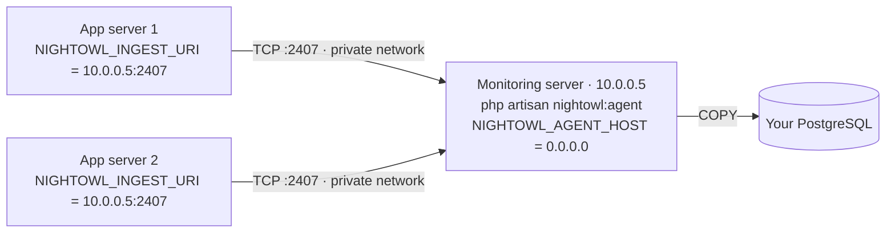

By default everything runs on one box: your app transmits to the agent on loopback, and the agent drains to PostgreSQL. But the agent doesn't have to live with your app. A common production layout is a dedicated monitoring server — one machine running the agent daemon and (often) PostgreSQL, with one or more app servers shipping telemetry to it over the network via `NIGHTOWL_INGEST_URI`.

Use this layout when you run multiple app servers and want one telemetry pipeline, or when you want monitoring load (buffering, drain, Postgres writes) off your app boxes entirely. If your app runs on Laravel Vapor, see the [Vapor guide](/agent/vapor) — same split, serverless specifics.

## How it fits together



The app servers **collect** telemetry and transmit it over TCP. The monitoring server **buffers and drains** it to PostgreSQL. Only the monitoring server holds database credentials — the app servers never open a database connection.

<Note>
  Install the `nightowl/agent` package in your application as usual and deploy the **same release** to every machine, monitoring server included. On the app servers the package only redirects Nightwatch's collector to `NIGHTOWL_INGEST_URI` — you never run the daemon there. On the monitoring server you run `php artisan nightowl:agent`.
</Note>

## Which variable goes on which machine

Each machine reads its own `.env`. Setting a variable on the wrong side does nothing — this is the most common misconfiguration in this layout.

| Variable | App servers | Monitoring server |
| -------- | ----------- | ----------------- |
| `NIGHTOWL_TOKEN` | ✅ same value | ✅ same value |
| `NIGHTOWL_INGEST_URI` | ✅ the agent's `host:port` | — |
| `NIGHTOWL_INGEST_TIMEOUT` | ✅ | — |
| `NIGHTOWL_AGENT_HOST` / `NIGHTOWL_AGENT_PORT` | — | ✅ where the daemon binds |
| `NIGHTOWL_DB_*` | — | ✅ drain target |
| Drain, retention, alert, and health settings | — | ✅ |

## Setup

<Steps>
  <Step title="Run the agent on the monitoring server">
    Deploy your application there and start the daemon under a supervisor, exactly as in [Production deployment](/agent/production-deployment). Bind it beyond loopback so the app servers can reach it:

    ```env
    NIGHTOWL_AGENT_HOST=0.0.0.0       # or the machine's private IP
    NIGHTOWL_AGENT_PORT=2407
    NIGHTOWL_TOKEN=your-agent-token   # from the dashboard (Settings → Agent token)

    NIGHTOWL_DB_HOST=your-postgres-host
    NIGHTOWL_DB_PORT=5432
    NIGHTOWL_DB_DATABASE=nightowl
    NIGHTOWL_DB_USERNAME=nightowl
    NIGHTOWL_DB_PASSWORD=secret
    NIGHTOWL_DB_SSLMODE=require
    ```

    Run `php artisan nightowl:migrate` on this machine as part of its deploy — it owns the schema.
  </Step>

  <Step title="Open the ingest port to your app servers only">
    Add a firewall rule (ufw, cloud firewall, or security group) allowing inbound TCP `2407` from each app server's address — ideally their **private** addresses on the same VPC:

    | Setting  | Value                                     |
    | -------- | ----------------------------------------- |
    | Protocol | TCP                                       |
    | Port     | `2407`                                    |
    | Source   | your app servers' IPs (or the VPC subnet) |

    Telemetry travels over plain TCP (token-gated, not encrypted in transit), so never open `2407` to `0.0.0.0/0`.
  </Step>

  <Step title="Point each app server at the agent">
    On every app server:

    ```env
    NIGHTOWL_INGEST_URI=10.0.0.5:2407   # the monitoring server's PRIVATE address
    NIGHTOWL_INGEST_TIMEOUT=1.0         # raise the 0.5s loopback default for the network hop
    NIGHTOWL_TOKEN=your-agent-token     # the SAME token the agent verifies against
    ```

    Prefer the private/VPC address. If a server must cross the public internet to reach the agent, set `NIGHTOWL_INGEST_TIMEOUT=3` — public routes have latency spikes a 1-second budget will occasionally lose to.

    If you cache configuration, run `php artisan config:cache` and restart your workers after changing these.
  </Step>

  <Step title="Verify">
    Open the [health dashboard](/agent/health-monitoring): ingest rate should track your app traffic and buffer depth should stay low. Deploy new releases to **all** machines together — the app servers and the daemon must agree on the wire format — and restart the daemon after upgrading.
  </Step>
</Steps>

## Troubleshooting

**Intermittent `stream_socket_client(): Unable to connect to tcp://... (Connection timed out)` in your exceptions feed, while telemetry mostly flows.** This is the transmit timeout losing to the network, not a broken setup. The default `NIGHTOWL_INGEST_TIMEOUT` is 0.5 seconds — tuned for loopback, tight for a network hop and much too tight for the public internet. Raise it on the **app servers** (it does nothing on the monitoring server), and switch `NIGHTOWL_INGEST_URI` to the private address if you're currently using the public one. Each occurrence also means that batch of telemetry was dropped.

If you run several app servers, open the timeout exception's detail page: the **SERVERS** stat tells you where it comes from. All of them → look at the agent machine (health dashboard, load, network). Just one → that machine's route or firewall.

**Every connection times out, nothing arrives.** The packets are being dropped before they reach the daemon — almost always the firewall (a closed port *times out*; a reachable machine with no listener *refuses*). Check the firewall rule first, then that the daemon is running and bound beyond loopback: `ss -tlnp | grep 2407` on the monitoring server should show `0.0.0.0:2407` (or the private IP), not `127.0.0.1:2407`.

**Connections refused.** The machine is reachable but nothing listens on that address: the daemon isn't running, or `NIGHTOWL_AGENT_HOST` is still the loopback default.

**Telemetry arrives but the payloads are rejected.** `NIGHTOWL_TOKEN` differs between the app server and the monitoring server — it must be identical on both sides.
